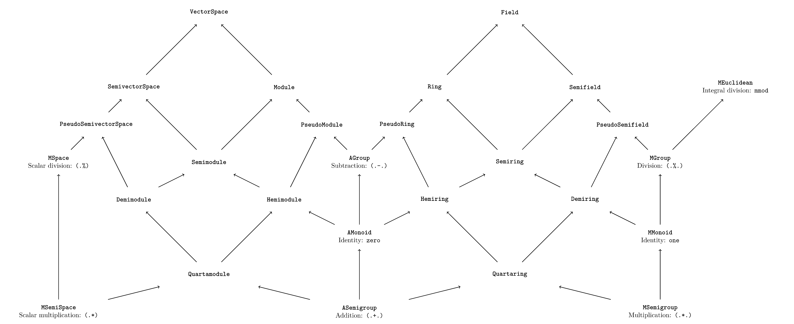

# Algebra Simple

---

### Table of Contents
* [Overview](#overview)
* [Algebraic Typeclasses](#algebraic-typeclasses)
  * [Motivation](#motivation)
  * [Solution](#solution)
  * [Principles](#principles)
  * [A note on names](#a-note-on-names)
* [Miscellaneous](#miscellaneous)

# Overview

`Algebra-Simple` intends to provide a simple, reasonably principled interface to typical operations (i.e. addition, subtraction, multiplication, division). This package is organized into two sections: `Numeric.Algebra` and `Numeric.Convert`.

# Algebraic Typeclasses

## Motivation

The primary interface to numerical operations in Haskell is `Num`. Unfortunately, `Num` has a key limitation: it is "too large". For example, if we want to opt-in to addition, we must also opt-in to subtraction, multiplication, and integer literal conversions. These may not make sense for the type at hand (e.g. naturals), so we are stuck either providing an invariant-breaking dangerous implementation (e.g. defining subtraction for arbitrary naturals) or throwing runtime errors.

## Solution

`algebra-simple`'s approach is to split this functionality into multiple typeclasses, so types can opt-in to exactly as much functionality as they want. The typeclasses are inspired by abstract algebra. The algebraic hierarchy can be found in the following diagram. An arrow `A -> B` should be read as "`B` is an `A`". For example, a `Module` is both a `Semimodule` and an `AGroup`.

A longer description can be found in the table below, along with the `Num` functionality they are intended to replace:

### Scalar classes

<table>
  <thead>
    <th>Typeclass</th>
    <th>Description</th>
    <th>New</th>
    <th>Num</th>
  </thead>
  <tr>
    <td><code>ASemigroup</code></td>
    <td>Addition.</td>
    <td><code>(.+.)</code></td>
    <td><code>(+)</code></td>
  </tr>
  <tr>
    <td><code>AMonoid</code></td>
    <td><code>ASemigroup</code> with identity.</td>
    <td><code>zero</code></td>
    <td></td>
  </tr>
  <tr>
    <td><code>AGroup</code></td>
    <td>Subtraction.</td>
    <td><code>(.-.)</code></td>
    <td><code>(-)</code></td>
  </tr>
  <tr>
    <td><code>MSemigroup</code></td>
    <td>Multiplication.</td>
    <td><code>(.*.)</code></td>
    <td><code>(*)</code></td>
  </tr>
  <tr>
    <td><code>MMonoid</code></td>
    <td><code>MSemigroup</code> with identity.</td>
    <td><code>one</code></td>
    <td></td>
  </tr>
  <tr>
    <td><code>MGroup</code></td>
    <td>Division.</td>
    <td><code>(.%.)</code></td>
    <td><code>div</code>, <code>(/)</code></td>
  </tr>
  <tr>
    <td><code>MEuclidean</code></td>
    <td>Euclidean division.</td>
    <td><code>mdivMode</code></td>
    <td><code>divMod</code></td>
  </tr>
  <tr>
    <td><code>Normed</code></td>
    <td>Types that support a "norm".</td>
    <td><code>norm</code>, <code>sgn</code></td>
    <td><code>abs</code>, <code>signum</code></td>
  </tr>
  <tr>
    <td><code>Quartaring</code></td>
    <td><code>ASemigroup</code> and <code>MSemigroup</code>.</td>
    <td></td>
    <td></td>
  </tr>
  <tr>
    <td><code>Hemiring</code></td>
    <td><code>AMonoid</code> and <code>Quartaring</code>.</td>
    <td></td>
    <td></td>
  </tr>
  <tr>
    <td><code>Demiring</code></td>
    <td><code>MMonoid</code> and <code>Quartaring</code>.</td>
    <td></td>
    <td></td>
  </tr>
  <tr>
    <td><code>Semiring</code></td>
    <td><code>Hemiring</code> and <code>Demiring</code>.</td>
    <td></td>
    <td></td>
  </tr>
  <tr>
    <td><code>PseudoRing</code></td>
    <td><code>AGroup</code> and <code>Hemiring</code>.</td>
    <td></td>
    <td></td>
  </tr>
  <tr>
    <td><code>Ring</code></td>
    <td><code>Semiring</code> and <code>PseudoRing</code>.</td>
    <td></td>
    <td></td>
  </tr>
  <tr>
    <td><code>PseudoSemifield</code></td>
    <td><code>MGroup</code> and <code>Demiring</code>.</td>
    <td></td>
    <td></td>
  </tr>
  <tr>
    <td><code>Semifield</code></td>
    <td><code>Semiring</code> and <code>PseudoSemifield</code>.</td>
    <td></td>
    <td></td>
  </tr>
  <tr>
    <td><code>Field</code></td>
    <td><code>Ring</code> and <code>Semifield</code>.</td>
    <td></td>
    <td></td>
  </tr>
</table>

### Space-like classes

<table>
  <thead>
    <th>Typeclass</th>
    <th>Description</th>
    <th>New</th>
  </thead>
  <tr>
    <td><code>MSemiSpace</code></td>
    <td>Scalar multiplication.</td>
    <td><code>(.*)</code>, <code>(*.)</code></td>
  </tr>
  <tr>
    <td><code>MSpace</code></td>
    <td>Scalar division.</td>
    <td><code>(.%)</code>, <code>(%.)</code></td>
  </tr>
  <tr>
    <td><code>Quartamodule</code></td>
    <td><code>ASemigroup</code> and <code>MSemiSpace</code>.</td>
    <td></td>
  </tr>
  <tr>
    <td><code>Hemimodule</code></td>
    <td><code>AMonoid</code> and <code>Quartamodule</code>.</td>
    <td></td>
  </tr>
  <tr>
    <td><code>Demimodule</code></td>
    <td><code>Quartamodule</code>.</td>
    <td></td>
  </tr>
  <tr>
    <td><code>Semimodule</code></td>
    <td><code>Hemimodule</code> and <code>Demimodule</code>.</td>
    <td></td>
  </tr>
  <tr>
    <td><code>PseudoModule</code></td>
    <td><code>AGroup</code> and <code>Hemimodule</code>.</td>
    <td></td>
  </tr>
  <tr>
    <td><code>Module</code></td>
    <td><code>Semimodule</code> and <code>PseudoModule</code>.</td>
    <td></td>
  </tr>
  <tr>
    <td><code>PseudoSemivectorSpace</code></td>
    <td><code>MSpace</code> and <code>Demimodule</code>.</td>
    <td></td>
  </tr>
  <tr>
    <td><code>SemivectorSpace</code></td>
    <td><code>Semimodule</code> and <code>Demimodule</code>.</td>
    <td></td>
  </tr>
  <tr>
    <td><code>VectorSpace</code></td>
    <td><code>Module</code> and <code>SemivectorSpace</code></td>
    <td></td>
  </tr>
</table>

## Principles

We have the following guiding principles:

1. Simplicity

    This is not a comprehensive implementation of abstract algebra, merely the classes needed to replace the usual `Num`-like functionality. For the former, see [algebra](https://hackage.haskell.org/package/algebra).

2. Practicality

    When there is tension between practicality and theoretical "purity", we favor the former. To wit:

    * We provide two semigroup/monoid/group hierarchies:
       `ASemigroup`/`AMonoid`/`AGroup` and
       `MSemigroup`/`MMonoid`/`MGroup`. Formally this is clunky, but it allows us to:

        * Reuse the same operator for ring multiplication and types that have sensible multiplication but cannot be rings (e.g. naturals).

        * Provide both addition and multiplication without an explosion of newtype wrappers.

    * Leniency vis-à-vis algebraic laws

        For instance, integers cannot satisfy the field laws, and floats do not satisfy anything, as their equality is nonsense. Nevertheless, we provide instances for them. Working with technically unlawful numerical instances is extremely common, so we take the stance that it is better to provide such instances (albeit with known limitations) than to forgo them completely (read: integer division is useful). The only instances we disallow are those likely to cause runtime errors (e.g. natural subtraction) or break expected invariants.

    * Division classes (i.e. `MGroup`, `VectorSpace`) have their own division function that must be implemented. Theoretically this is unnecessary, as we need only a function `inv :: a -> a` and we can then define division as `x .%. d = x .*. inv d`. But this will not work for many types (e.g. integers), so we force users to define a (presumably sensible) `(.%.)`, so there is no chance of accidentally using a nonsensical `inv`.

3. Safety

    Instances that break the type's invariants (`instance Ring Natural`), are banned. Furthermore, instances that are _highly_ likely to go wrong (e.g. `Ratio` with bounded integral types) are also forbidden.

4. Ergonomics

     We choose new operators that do not clash with prelude.

We provide instances for built-in numeric types where it makes sense.

## A note on names

In general, we try to use canonical mathematical names where possible. In some cases, however, either a canonical name does not exist, or an existing one does not fit well with the rest. We can categorize them thusly:

### Scalar classes

#### Canonical, widely used

- `Semigroup`
- `Monoid`
- `Group`
- `Ring`
- `Field`

These names are all canonical and widely used. We do separate our additive and multiplicative `Semigroup/Monoid/Group` hierarchies into `A(dditive)` and `M(ultiplicative)` variants for convenience, but otherwise everything is standard.

#### Canonical, niche

- `Hemiring`
- `Semiring`
- `Semifield`

`Semiring` is relatively well-referenced in computer science. `Semifield` and (especially) `Hemiring` are quite obscure, but references do exist.

#### Established, ambiguous

- `PseudoRing`

What we here call a `PseudoRing` is more commonly called an `rng` by number theorists, enough to arguably give it canonical status. Unfortunately, `PseudoRing` is ambigous in that it has at least 3 distinct definitions. That said, we choose `PseudoRing` as it fits better with our hiearchy and naming scheme.

#### Bespoke

- `Quartaring`
- `Demiring`
- `PseudoSemifield`

Unfortunately, there do not appear to be established names for all the combinations we want.

We take `PseudoSemifield` to be the multiplicative reflection (`Semifield` without additive identity) of `PseudoRing` (`Ring` without multiplicative identity), hence favoring the `Pseudo` prefix for both.

`Demiring` is inspired by `Hemiring`, as both can be thought of as "partial `Semirings`" (each losing a different identity). Consequently, a `Quartaring` -- losing both identities -- is an even *less* complete version of a `Semiring`.

### Space-like classes

We can categorize the space-like classes similarly, and thankfully it is mostly straightforward once we have the scalar names.

#### Canonical, widely used

- `Module`
- `VectorSpace`

#### Canonical, niche

- `Semimodule`
- `SemivectorSpace`

#### Bespoke

- `MSemiSpace`
- `MSpace`
- `Quartamodule`
- `Hemimodule`
- `Demimodule`
- `PseudoModule`
- `PseudoSemivectorSpace`

These are all straightforward translations of their respective scalar classes, trading `Ring` for `Module` and `Field` for `VectorSpace`. `MSemiSpace` and `MSpace` are the low-level building blocks for the actual algebraic classes we want.

Final note: `Quarta`, `Hemi`, `Demi`, and `Semi` are not considered word breaks, unlike `Pseudo` and `Space`.

# Miscellaneous

Finally, there are typeclasses in `Numeric.Convert` for conversions.
