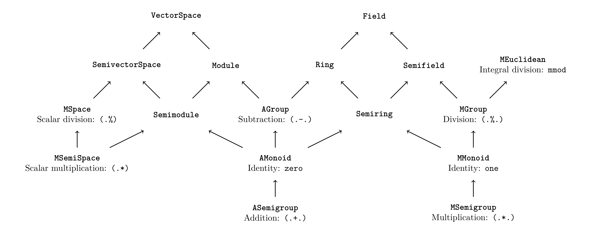

# Algebra Simple

---

### Table of Contents
* [Overview](#overview)
* [Algebraic Typeclasses](#algebraic-typeclasses)
  * [Motivation](#motivation)
  * [Solution](#solution)
* [Smart Constructors](#smart-constructors)
* [Miscellaneous](#miscellaneous)

# Overview

`Algebra-Simple` intends to provide a simple, reasonably principled interface to typical operations (i.e. addition, subtraction, multiplication, division). This package is organized into three sections: `Numeric.Algebra`, `Numeric.Data`, and `Numeric.Literal`.

# Algebraic Typeclasses

## Motivation

The primary interface to numerical operations in Haskell is `Num`. Unfortunately, `Num` has a key limitation: it is "too large". For example, if we want to opt-in to addition, we must also opt-in to subtraction, multiplication, and integer literal conversions. These may not make sense for the type at hand (e.g. naturals), so we are stuck either providing an invariant-breaking dangerous implementation (e.g. defining subtraction for arbitrary naturals) or throwing runtime errors.

## Solution

`algebra-simple`'s approach is to split this functionality into multiple typeclasses, so types can opt-in to exactly as much functionality as they want. The typeclasses are inspired by abstract algebra. The algebraic hierarchy can be found in the following diagram. An arrow `A -> B` should be read as "`B` is an `A`". For example, a `Module` is both a `Semimodule` and an `AGroup`.

A longer description can be found in the table below, along with the `Num` functionality they are intended to replace:

<table>
  <thead>
    <th>Typeclass</th>
    <th>Description</th>
    <th>New</th>
    <th>Num</th>
  </thead>
  <tr>
    <td><code>ASemigroup</code></td>
    <td>Types that support "addition".</td>
    <td><code>(.+.)</code></td>
    <td><code>(+)</code></td>
  </tr>
  <tr>
    <td><code>AMonoid</code></td>
    <td><code>ASemigroup</code>s that have an identity.</td>
    <td><code>zero</code></td>
    <td></td>
  </tr>
  <tr>
    <td><code>AGroup</code></td>
    <td><code>AMonoid</code>s that support "subtraction".</td>
    <td><code>(.-.)</code></td>
    <td><code>(-)</code></td>
  </tr>
  <tr>
    <td><code>MSemigroup</code></td>
    <td>Types that support "multiplication".</td>
    <td><code>(.*.)</code></td>
    <td><code>(*)</code></td>
  </tr>
  <tr>
    <td><code>MMonoid</code></td>
    <td><code>MSemigroup</code>s that have an identity.</td>
    <td><code>one</code></td>
    <td></td>
  </tr>
  <tr>
    <td><code>MGroup</code></td>
    <td><code>MMonoid</code>s that support "division".</td>
    <td><code>(.%.)</code></td>
    <td><code>div</code>, <code>(/)</code></td>
  </tr>
  <tr>
    <td><code>MEuclidean</code></td>
    <td><code>MGroup</code>s that support "remainder division".</td>
    <td><code>mmod</code></td>
    <td><code>mod</code></td>
  </tr>
  <tr>
    <td><code>Normed</code></td>
    <td>Types that support a "norm".</td>
    <td></td>
    <td></td>
  </tr>
  <tr>
    <td><code>Semiring</code></td>
    <td><code>AMonoid</code> and <code>MMonoid</code>.</td>
    <td></td>
    <td></td>
  </tr>
  <tr>
    <td><code>Ring</code></td>
    <td><code>AGroup</code> and <code>MMonoid</code>.</td>
    <td></td>
    <td></td>
  </tr>
  <tr>
    <td><code>Semifield</code></td>
    <td><code>AMonoid</code> and <code>MGroup</code>.</td>
    <td></td>
    <td></td>
  </tr>
  <tr>
    <td><code>Field</code></td>
    <td><code>Ring</code> and <code>Semifield</code>.</td>
    <td></td>
    <td></td>
  </tr>
  <tr>
    <td><code>MSemiSpace</code></td>
    <td>Types that support "scalar multiplication".</td>
    <td><code>(.*)</code>, <code>(*.)</code></td>
    <td></td>
  </tr>
  <tr>
    <td><code>MSpace</code></td>
    <td><code>MSemiSpace</code>s that support "scalar division".</td>
    <td><code>(.%)</code></td>
    <td></td>
  </tr>
  <tr>
    <td><code>Semimodule</code></td>
    <td><code>AMonoid</code> and <code>MSemiSpace</code>.</td>
    <td></td>
    <td></td>
  </tr>
  <tr>
    <td><code>Module</code></td>
    <td><code>Semimodule</code>s that are <code>AGroup</code>s.</td>
    <td></td>
    <td></td>
  </tr>
  <tr>
    <td><code>SemivectorSpace</code></td>
    <td><code>Semimodule</code>s that are "scalar division"</td>
    <td><code>(.%)</code></td>
    <td></td>
  </tr>
  <tr>
    <td><code>VectorSpace</code></td>
    <td><code>Module</code> and <code>SemivectorSpace</code></td>
    <td></td>
    <td></td>
  </tr>
</table>

We have the following guiding principles:

1. Simplicity

    This is not a comprehensive implementation of abstract algebra, merely the classes needed to replace the usual `Num`-like functionality. For the former, see [algebra](https://hackage.haskell.org/package/algebra).

2. Practicality

    When there is tension between practicality and theoretical "purity", we favor the former. To wit:

    * We provide two semigroup/monoid/group hierarchies:
       `ASemigroup`/`AMonoid`/`AGroup` and
       `MSemigroup`/`MMonoid`/`MGroup`. Formally this is clunky, but it allows us to:

        * Reuse the same operator for ring multiplication and types that have sensible multiplication but cannot be rings (e.g. naturals).

        * Provide both addition and multiplication without an explosion of newtype wrappers.

    * Leniency vis-à-vis algebraic laws

        For instance, integers cannot satisfy the field laws, and floats do not satisfy anything, as their equality is nonsense. Nevertheless, we provide instances for them. Working with technically unlawful numerical instances is extremely common, so we take the stance that it is better to provide such instances (albeit with known limitations) than to forgo them completely (read: integer division is useful). The only instances we disallow are those likely to cause runtime errors (e.g. natural subtraction) or break expected invariants.

    * Division classes (i.e. `MGroup`, `VectorSpace`) have their own division function that must be implemented. Theoretically this is unnecessary, as we need only a function `inv :: NonZero a -> NonZero a` and we can then define division as `x .%. d = x .*. inv d`. But this will not work for many types (e.g. integers), so we force users to define a (presumably sensible) `(.%.)`, so there is no chance of accidentally using a nonsensical `inv`.

3. Safety

    Instances that break the type's invariants (`instance Ring Natural`), are banned. Furthermore, instances that are _highly_ likely to go wrong (e.g. `Rational` with bounded integral types) are also forbidden.

4. Ergonomics

     We choose new operators that do not clash with prelude.

We provide instances for built-in numeric types where it makes sense.

# Smart Constructors

Additionally, there is a smart constructor for a simple `NonZero` type. This is likely to change in the future when we can pass in a direct proof.

# Miscellaneous

Finally, there are typeclasses in `Numeric.Literal` for literal conversions.
